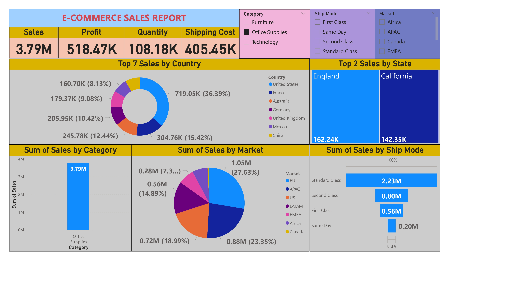
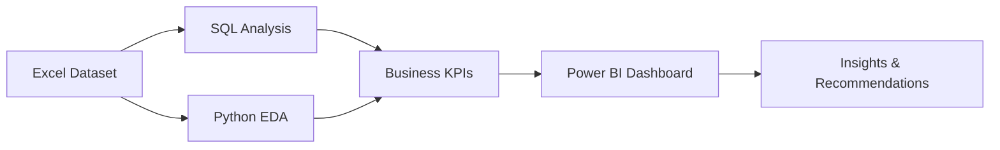

# E-Commerce Sales & Customer Analytics Dashboard

## Executive Summary

This project analyzes global e-commerce order data to understand sales performance, customer behavior, category trends, profitability, regional performance, and discount impact. The original Power BI dashboard has been expanded into an end-to-end analytics portfolio project using SQL, Python, and Power BI.

The business objective is to help leadership identify where revenue is growing, where profit is leaking, which customer/product groups deserve attention, and how discounting and shipping decisions affect margins.

The analysis helps answer business questions such as:

- Which markets, countries, and states generate the most revenue?
- Which product categories and sub-categories drive sales and profit?
- How do discounts affect profitability?
- Which customer segments contribute the most sales?
- Which shipping modes are most used and how do they affect cost?
- Where should the business focus to improve profit margins?

## Dashboard Preview



> Note: the current Power BI file is kept as a reference export. A new dashboard will be built as the final project step using the completed SQL and Python analysis.

## Project Goal

Build an end-to-end analytics project that analyzes:

- Sales performance
- Customer behavior
- Product and category trends
- Profit analysis
- Regional performance
- Discount impact
- Business recommendations

## Tools Used

| Tool | Purpose |
| --- | --- |
| SQL | Data exploration, KPI calculation, segmentation, trend analysis |
| Python | Data cleaning, exploratory data analysis, charts, feature engineering |
| Power BI | Dashboard development and interactive business reporting |
| Excel | Source data storage |
| GitHub | Project documentation and version control |

## Dataset Overview

The dataset contains global e-commerce transactions from **2011-01-01** to **2014-12-31**.

| Table / Sheet | Description |
| --- | --- |
| Orders | Main order-level transaction data |
| Returns | Returned order information |
| People | Region-to-manager mapping |

Key fields include:

- Order ID, Order Date, Ship Date
- Customer ID, Customer Name, Segment
- Country, Market, Region, State, City
- Category, Sub-Category, Product Name
- Sales, Quantity, Discount, Shipping Cost, Profit
- Ship Mode, Order Priority

## Key KPIs

| KPI | Value |
| --- | ---: |
| Total Sales | 12.64M |
| Total Profit | 1.47M |
| Total Orders | 25,035 |
| Average Order Value | 504.99 |
| Profit Margin % | 11.61% |
| Top Region | Central |
| Top Category | Technology |
| Repeat Customer Rate | 99.37% |

Additional operational metrics:

| Metric | Value |
| --- | ---: |
| Total Quantity | 178.31K |
| Total Shipping Cost | 1.35M |
| Order Line Items | 51,290 |
| Returned Orders | 1,173 |

## Project Architecture



```text
ecommerce-sales-customer-analysis/
├── data/
│   └── ecommerce_data.xlsx
├── sql/
│   └── ecommerce_analysis.sql
├── notebooks/
│   ├── analysis.ipynb
│   └── ecommerce_eda.py
├── assets/
│   └── screenshots/
│       └── ecommerce_dashboard_preview.jpg
├── dashboards/
│   ├── ecommerce_sales_dashboard_reference.pbix
│   └── ecommerce_sales_dashboard_reference.pdf
├── docs/
│   ├── data_dictionary.md
│   ├── project_architecture.md
│   ├── data_quality_and_feature_engineering.md
│   ├── customer_profitability_analysis.md
│   ├── time_series_regional_analysis.md
│   ├── dashboard_interactivity.md
│   └── kpi_framework.md
├── requirements.txt
├── LICENSE
└── README.md
```

## Analysis Performed

### 1. Sales Performance

- Calculated total sales, profit, total orders, average order value, and profit margin.
- Analyzed sales trends by year and month.
- Identified high-performing markets, countries, and states.

### 2. Customer Behavior

- Measured sales by customer segment.
- Identified top customers by revenue and profit.
- Compared consumer, corporate, and home office performance.
- Flagged repeat customers and compared repeat vs one-time customer contribution.
- Calculated basic customer lifetime value using total customer sales.
- Analyzed sales by customer type and customer segment.

### 3. Product & Category Trends

- Compared sales and profit across Furniture, Office Supplies, and Technology.
- Identified top sub-categories and products.
- Evaluated categories with high sales but weak profitability.

### 4. Profit Analysis

- Calculated profit margin.
- Compared profitable and loss-making products.
- Analyzed regions and categories with negative profit.
- Compared profit by category and sub-category.
- Identified low-margin products.
- Measured discount impact on profit margin.

### 5. Regional Performance

- Compared sales across APAC, EU, US, LATAM, EMEA, Africa, and Canada.
- Identified top countries and states.
- Evaluated market-level contribution to total sales.
- Added region-wise profit and margin analysis.
- Added state-wise sales and city performance analysis.
- Added regional growth trends by year.

### 6. Discount Impact

- Compared profit margins across discount ranges.
- Identified cases where high discounts reduced profitability.
- Highlighted categories and regions sensitive to discounting.

### 7. Advanced SQL Analysis

- Used CTEs to structure multi-step analysis.
- Used joins to combine orders, returns, and regional manager data.
- Used subqueries to identify customers above average revenue.
- Used window functions for ranking, running totals, and year-over-year growth.
- Calculated sales and profit contribution by market, category, and sub-category.

### 8. Python EDA Notebook

- Cleaned and standardized dataset columns.
- Performed null, duplicate, datatype, outlier, and category validation checks.
- Engineered date, shipping, return, discount, and profit-margin features.
- Calculated business KPIs.
- Created charts for sales trend, category performance, market performance, discount impact, and customer segment analysis.
- Added written business insights directly inside the notebook.

### 9. Data Cleaning & Feature Engineering

- Checked null values across all key fields.
- Checked duplicate rows and duplicate order/product line items.
- Converted order and ship dates into datetime fields.
- Flagged sales, profit, discount, quantity, and shipping-cost outliers using the IQR method.
- Standardized category, segment, market, region, and ship-mode labels.
- Created `order_year`, `order_month`, `shipping_delay`, `profit_margin`, `customer_segment`, `sales_bucket`, `discount_band`, and `is_returned`.

### 10. Customer & Profitability Depth

- Ranked top customers by sales, profit, and basic customer lifetime value.
- Compared repeat customers against one-time customers.
- Analyzed Consumer, Corporate, and Home Office segment performance.
- Identified profit by category, loss-making products, low-margin products, and discount-sensitive product groups.

### 11. Time-Series Analysis

- Built monthly sales and profit trends.
- Added yearly sales, profit, order, and margin trend analysis.
- Added a 3-month moving average to smooth monthly sales volatility.
- Analyzed seasonality by calendar month.
- Ranked peak sales periods by monthly revenue.

### 12. Regional Analysis Depth

- Compared region-wise profit, sales, orders, and profit margin.
- Ranked top states by sales and profit.
- Ranked top cities by sales, profit, orders, and margin.
- Measured regional year-over-year sales growth.

## Business Insights

- **APAC is the highest revenue-generating market**, followed by EU and the US.
- **Technology generates the highest sales**, while Office Supplies contributes strong order volume.
- **Standard Class is the dominant shipping mode**, contributing the majority of sales.
- **The United States is the top country by sales**, followed by Australia and France.
- **England and California are among the strongest state-level performers.**
- **Discounting requires careful control**, because higher discounts can reduce or reverse profit margins.
- **High sales should not be treated as success by itself**; category, market, and customer performance must be evaluated together with profit margin.
- **Returns and shipping cost are operational levers** that can directly affect both customer experience and profitability.
- **Repeat customers represent a major retention signal**, making customer loyalty and repeat purchase behavior important for future growth.
- **Low-margin and loss-making products should be reviewed before scaling promotions**, because discount-driven revenue can weaken total profit.

## Recommendations

- Prioritize high-performing markets such as APAC, EU, and the US for growth campaigns.
- Review low-profit and negative-profit products before increasing promotion spend.
- Use discount thresholds to prevent margin erosion.
- Optimize shipping strategy by monitoring Standard Class volume and shipping cost.
- Focus category-level strategy on Technology growth while improving Furniture profitability.
- Track returned orders to identify product, region, or shipping-related quality issues.
- Build retention campaigns around high-value and repeat customers.
- Review low-margin products for pricing, discount, or sourcing improvements.

## Business Conclusion

The dashboard and analysis show that the business has strong global revenue potential, but profitability depends on disciplined discounting, product-level margin review, and regional execution. The most valuable next step is to combine sales growth targets with margin guardrails so that expansion does not come at the cost of profit.

## Power BI Dashboard Features

The final Power BI dashboard will include:

- KPI cards for total sales, total profit, total orders, AOV, profit margin, and repeat customer rate
- Slicers for date, region, market, category, segment, ship mode, customer type, and discount band
- Drill-downs from category to sub-category to product
- Drill-downs from region to state to city
- Filters for returned orders, discount bands, sales buckets, and customer type
- Interactive visuals for trend analysis, product performance, customer analytics, profitability, and regional performance
- Cross-filtering so selecting one chart updates the rest of the dashboard

## Skills Demonstrated

- SQL data analysis
- Python exploratory data analysis
- Data cleaning and feature engineering
- KPI design
- Profitability analysis
- Power BI dashboarding
- Business insight generation
- GitHub project documentation

## How to Use This Project

1. Open `data/ecommerce_data.xlsx` to review the source dataset.
2. Run SQL queries from `sql/ecommerce_analysis.sql` after importing the data into a SQL database.
3. Install Python dependencies:

```bash
pip install -r requirements.txt
```

4. Run Python EDA:

```bash
python notebooks/ecommerce_eda.py
```

5. Open the notebook:

```bash
jupyter notebook notebooks/analysis.ipynb
```

6. Review the reference dashboard files in `dashboards/`.
7. Build the final Power BI dashboard using the completed KPI framework and analysis outputs.

## Project Files

| File | Description |
| --- | --- |
| `dashboards/ecommerce_sales_dashboard_reference.pbix` | Reference Power BI dashboard file |
| `dashboards/ecommerce_sales_dashboard_reference.pdf` | Reference exported dashboard report |
| `assets/screenshots/ecommerce_dashboard_preview.jpg` | Dashboard preview image |
| `data/ecommerce_data.xlsx` | Source dataset |
| `sql/ecommerce_analysis.sql` | SQL business analysis queries with CTEs, joins, subqueries, rankings, and window functions |
| `notebooks/analysis.ipynb` | Python EDA notebook with cleaning, KPIs, charts, and insights |
| `notebooks/ecommerce_eda.py` | Python EDA and feature engineering script |
| `docs/data_dictionary.md` | Data dictionary |
| `docs/project_architecture.md` | Workflow and architecture documentation |
| `docs/data_quality_and_feature_engineering.md` | Data cleaning checks and engineered feature documentation |
| `docs/customer_profitability_analysis.md` | Customer analytics and profitability analysis methodology |
| `docs/time_series_regional_analysis.md` | Time-series and regional analysis methodology |
| `docs/dashboard_interactivity.md` | Planned Power BI dashboard interactivity |
| `docs/kpi_framework.md` | KPI definitions, formulas, and current KPI snapshot |
