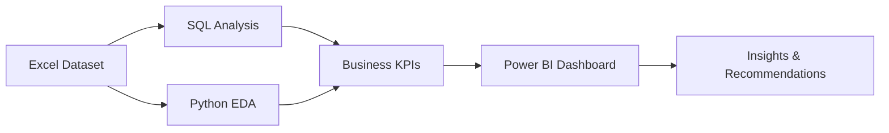

# Project Architecture

## Workflow

## Process Explanation

1. Source data is stored in Excel format.
2. SQL is used for structured business analysis, ranking, joins, CTEs, and KPI calculations.
3. Python is used for data cleaning, validation, feature engineering, EDA, and charts.
4. SQL and Python outputs define the KPI framework.
5. Power BI will be used as the final interactive dashboard layer.
6. Business insights and recommendations summarize actions leadership can take.

